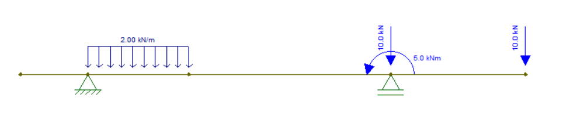
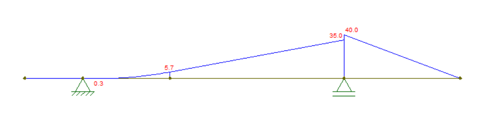

# Embasamento teórico

_O ensino de mecânica vetorial e o uso de diagramas para a visualização de esforços_

A mecânica pode ser definida como a Ciência que descreve e prevê as condições de repouso ou movimento dos corpos sob a ação de forças, podendo ser dividida em très partes: a mecânica dos fluidos, dos corpos deformáveis e a mecânica dos corpos rígidos, sendo essa o foco de estudo de disciplinas de introdução à mecânica vetorial e mecânica dos sólidos. 
No curso destas, a mecânica dos corpos rígidos é abordada para casos estáticos em condição de equilíbrio de modo que os casos estudados envolvem um entendimento das forças internas e externas em ação sobre corpos extensos, cenários retratos como o estudo de vigas simplificadas e das cargas aplicadas sobre estas. 
Com esse objetivo o cálculo das forças de reações nos pontos de apoio, do componente perpendicular a seção transversal da viga, chamado de força normal, do componente de esforços tangentes à seção transversal, designados como esforços cisalhantes e do momento binário, conhecido como fletor, e dos diagramas que representam esses vetores ao longo da viga tornam-se rotineiros ao longo das disciplinas que envolvem mecânica dos sólidos.

## Reações de Apoio

Para o estudo do equilíbrio dos corpos rígidos não basta conhecer somente as forças externas que agem sobre ele, mas também é necessário conhecer como este corpo rígido está apoiado. 1º Gênero (Apoio móvel): Impede movimento na direção normal (perpendicular) ao plano do apoio.
Permite movimento na direção paralela ao plano do apoio – translação livre. Permite rotação. Restringe uma translação, exigindo uma reação de apoio. Possui 2 graus de liberdade.

### 2º Gênero (Apoio Fixo):
Impede qualquer translação (movimento nas direções, normal e perpendicular, ao plano do apoio). Exige duas reações de apoio perpendiculares entre si. Permite rotação. Restringe duas translações, possuindo 1 grau de liberdade.

### 3º Gênero (Engastamento):
Impede qualquer translação e rotação. Exige três reações de apoio (duas forças perpendiculares entre si e um momento). Restringe duas translações e uma rotação, possuindo 0 grau de liberdade.

### 4º Gênero (Engastamento deslizante): 
Impede rotação e translação na direção perpendicular ao plano do apoio. Exige duas reações de apoio. Possui 1 grau de liberdade.

## Esforços Internos
O projeto de qualquer elemento estrutural ou mecânico requer uma investigação das cargas que atuam em seu interior para a garantia de que o material utilizado possa resistir a tal carregamento. De uma forma geral, os esforços internos: São os esforços estaticamente equivalentes a todo carregamento externo da estrutura, atuando em uma determinada seção, a fim de garantir o equilíbrio de todas elas. Uma seção divide uma estrutura em dois segmentos ou partes. Traduzem a influência da outra parte da viga, na seção transversal em exame. São aplicados no centro de gravidade da seção transversal. São funções de uma única variável, que é a seção transversal. Em duas dimensões, mostramos que existem três resultantes das cargas internas: Esforço Normal, Cortante e Momento Fletor.

### Esforço Normal
Atua na direção normal ou perpendicular ao plano da seção, provocando variação da distância entre as seções vizinhas. Provoca tração ou compressão da seção transversal.

### Esforço Cortante
Aplicada no plano da seção transversal, provocando escorregamento entre seções vizinhas. Tangente à seção transversal

## Momento Fletor
Tende a girar a seção em torno de um eixo perpendicular ao eixo da viga. Provoca flexão. O momento fletor faz com que cada seção gire em relação à sua vizinha, provocando tração em uma região da viga e compressão no lado oposto.

## Diagramas de Esforços Internos
O dimensionamento de uma estrutura requer um conhecimento detalhado da variação dos esforços que atuam ao longo da mesma. Os diagramas de esforços internos são traçados para se determinar a evolução dos esforços (cortante, normal e momento fletor) ao longo de toda uma estrutura. Diagramas de esforços são representações gráficas, permitindo avaliar como cada esforço varia ao longo da estrutura como um todo.	

# Software
Em software, serão utilizados fundamentos de visão computacional para que seja feito o reconhecimento de objetos assim como a deformação do material utilizado na estrutura. 
A linguagem de programação Python possui diversas bibliotecas voltadas ao processamento de imagem. 
* OpenCV: Biblioteca do Python para manipulação de imagens;
*Zbar : Biblioteca do Python útil na leitura e interpretação de QRCodes;
Após pesquisas, foram encontradas algumas técnicas úteis no processamento de imagem aplicáveis ao projeto:
* Transformada de Hough: Técnica matemática que realiza detecção de formas geométricas em imagens digitais;
* Algoritmo Canny: utilizado na detecção de bordas por meio da derivada;
* Técnicas para segmentação de cores;

Além do processamento de imagem será utilizado o software Ftool que é útil para simulação de forças em corpos extensos, conteúdo estudado em Mecânica dos Sólidos. Por meio do software é possível adicionar forças, apoios, direções e visualizar deformações além de gerar diagramas úteis na análise de esforços.
Para a aplicação móvel será utilizado o Java por meio do ambiente Android Studio. O java é uma linguagem orientada a objetos e bastante utilizada por ser feita para utilização em diversos contextos. Em resumo, uma mesma aplicação pode ser utilizada tanto em um relógio inteligente quanto em um smartphone, por exemplo.

