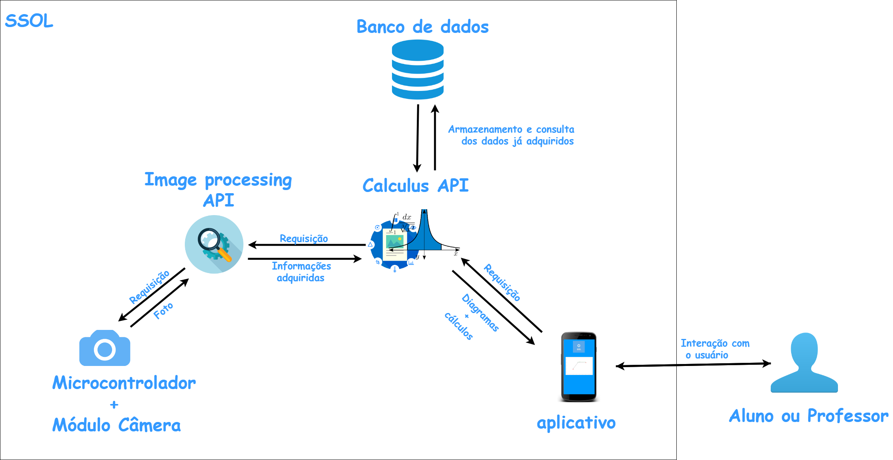

# Definição das Tecnologias e Metodologias de Software

## Principais Técnologias

### No Backend:

* Python 3: A linguagem será utilizada para programar todo o backend, por possuir as bibliotecas que oferecem os meios de realizar os requisitos elicitados.

* Flask: O Flask é um micro-framework para Python, focado em desenvolvimento Web, que será usado para construir as APIs do backend da aplicação. Além de vigorar sob a licença BSD, que permite uso livre desde que seja mantida a menção ao copyright do framework, o Flask é de fácil uso e aprendizado, por prover apenas o necessário para finalidade a qual ele se propõe. Por fim, as formas de deploy para produção utilizando este micro-framework também são simples e podem ser baratas dependendo da aplicação, já que o framework em sí é leve.

* Gunicorn: Com o flask já é incluído um Web server que consegue executar as aplicações, no entanto, este é feito apenas para uso em ambientes de desenvolvimento, e não é apropriado para ser utilizado em produção. Isso porque ele não oferece segurança, estabilidade, ou um gerenciamento de recursos bom o suficiente para tal, além de não atender multiplas requisições ao mesmo tempo. Para resolver esse problema, será utilizado o Gunicorn, que é um servidor HTTP em python para aplicações WSGI que oferece um bom desempenho, resolve todos os problemas mencionados, e é de fácil configuração.

* Docker: Docker é uma tecnologia que fornece uma camada adicional de abstração e automação de virtualização acima do sistema operacional. Será utilizado para facilitar o processo de desenvolvimento e evitar problemas que
normalmente são causados por ambientes de desenvolvimento configurados de formas diferentes. Além de facilitar o deploy e garantir que os requerimentos necessários para o funcionamento da aplicação sejam corretamente providos.  
* PostgreSQL: Sistema de gerenciamento de banco de dados relacional que será utilizado para gerenciar os dados que forem guardados. Foi escolhido pela sua eficiência e pelo quão amplamente é suportado.

* anaStruct: Biblioteca para linguagem Python dedicada a análise de estruturas bidimensionais. Será utilizada para gerar programacionalmente os diagramas estruturais, de esforços, momento fletor, e quaisquer outros produtos da aplicação dos conhecimentos de MecSol no experimento proposto.

* OpenCV: Biblioteca para linguagem Python que será utilizada para o processamento de imagens, por seu extenso ferramental de manipulação de imagem.

* Zbar : Biblioteca para linguagem Python que será utilizada para a leitura dos QRcodes envolvidos no processo.

### Para a aplicação mobile:

* Java: Linguagem de programação que será utilizada para o desenvolvimento do aplicativo destinado a dispositivos Android. 

* Android Studio: Ambiente de desenvolvimento integrado que será utilizado para desenvolver o aplicativo utilizando Java.

## Arquitetura do software

### Introdução

A arquitetura escolhida para o projeto foi a orientada a microsserviços. Essa abordagem foi preferida porque facilita o desenvolvimento e a evolução do software cuja lógica seja mais modularizada, com partes diferentes do sistema fazendo tarefas específicas, autônomas, e que podem ser produzidas de forma separada por times diferentes como se fossem projetos singulares. Dessa forma, cada microsserviço tem seu papel e comunicam-se com os outros, no caso deste projeto, através do protocolo HTTP. 

## Diagrama da arquitetura

* _Calculus API_: microsserviço responsável por gerenciar os diagramas e cálculos resultantes do experimento, podendo retorna-los de duas origens diferentes dependendo da requisição, a partir do banco de dados ou a partir de um novo processo de análises e cálculos. Quando a segunda opção entre em vigor, o microsserviço gera os novos resultados a partir de informações recebidas pela requisição, que deverão descrever as variáveis envolvidas, tais como os pesos, apoios e a barra. 

* _Image Processing API_:  microsserviço responsável por, a partir de uma imagem da bancada de experimentos que será provida pelo microcontrolador com o módulo câmera, identificar e retornar quando requisitado as informações relativas aos pesos, apoios e a barra, retiradas dos QRcodes e da diagramação através das técnicas de visão computacional. 

* _Aplicativo mobile_: Aplicativo pelo qual o usuário irá interagir digitalmente com o sistema, tanto para requisitar a geração de novos diagramas e cálculos quanto para ver os mesmos. 

## Referências

1. [Documentação do Flask](http://flask.pocoo.org/docs/)
2. [Deploy de aplicações utilizando Gunicorn no Heroku](https://devcenter.heroku.com/articles/python-gunicorn)
3. [Documentação do PostgreSQL](https://www.postgresql.org/docs/)
4. [Documentação da biblioteca anaStuct](https://anastruct.readthedocs.io/en/latest/) 
5. [Embasamento teórico do projeto](https://fga-projeto-integrador-1.github.io/SSol/Ponto%20de%20Controle%20I/08embasamento/)
6. [FOWLER, Martin & LEWIS, "Microservices in a nutshell"](https://www.thoughtworks.com/pt/insights/blog/microservices-nutshell)
