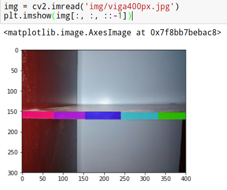
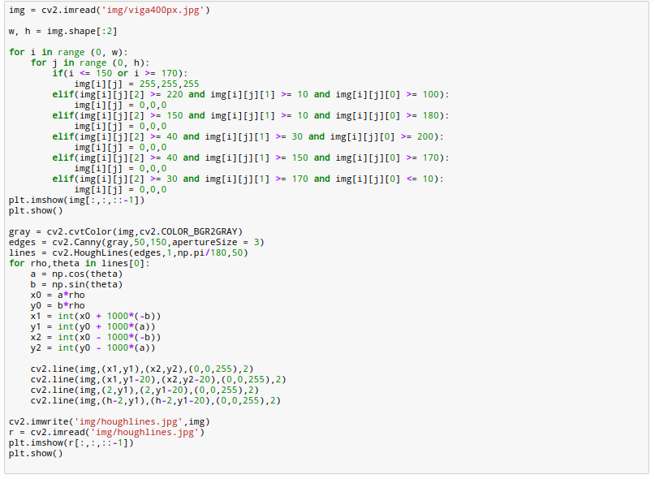
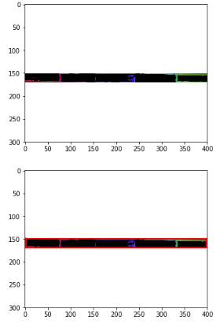
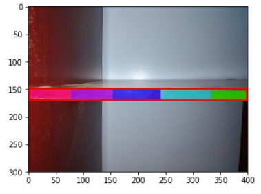
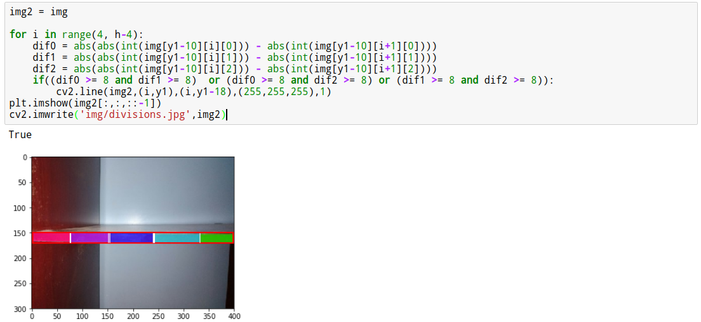
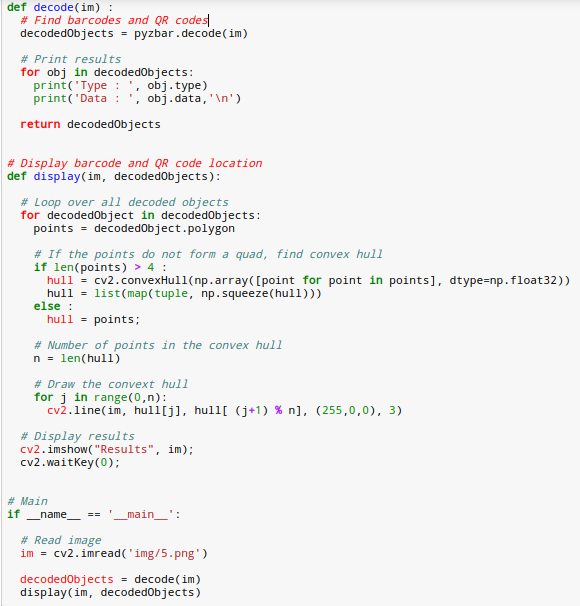
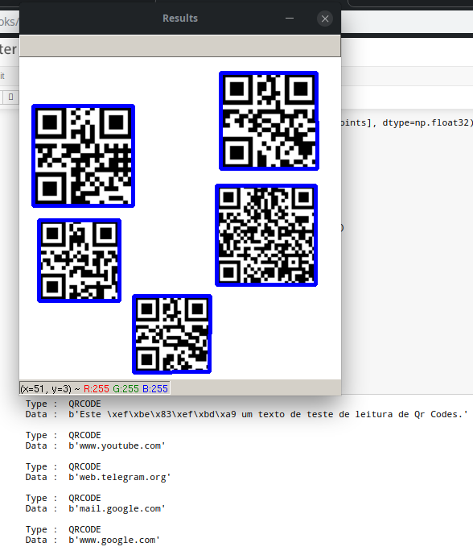

# Técnicas de Visão Computacional

## Detecção da viga e diferentes níveis de cor:
Antes de tudo é necessário instalar algumas bibliotecas. Recomenda-se instalar um ambiente virtual para evitar problemas no python nativo do computador. Para instalar é necessário o gerenciador de pacotes pip.

```
pip3 install opencv-python
pip3 install numpy
pip3 install matplotlib
```
E logo depois importá-las:
```
import cv2
import numpy as np
import matplotlib.pyplot as plt
```
Abrimos então a imagem da viga que será analisada já com as cores.



Detecção e binarização das cores escolhidas. Nesse caso não seria necessário fazer a binarização, as linha foram detectadas sem a necessidade de binarizar. Porém, deixarei a binarização pois pode ser útil para resolver algum problema no decorrer do projeto.



Após ser realizada a binarização é aplicada então a transformada de Hough amplamente utilizada para a detecção de retas em imagens. A detecção da viga está em vermelho.



Como foi mencionado para este caso não foi necessário realizar a binarização das cores, sendo assim, a transformada de Hough na imagem original foi suficiente para a detecção da barra.



Após detectada a viga é necessário identificar os diferentes níveis na mesma, isso será feito atraveś da detecção de cores diferentes na viga.
Para fazer isso percorre-se toda a viga e no momento em que é percebida uma mudança de cor adiciona-se uma marcação. Neste passo é de suma importância que a diferença de cores seja alta em todos as posições, R, G e B. Como as cores utilizadas no exemplo  não são tão diferentes assim a precisão na detecção não é tão alta.



## Leitura de mais de um QR Code simultaneamente

Para a realização da leitura é necessário que algumas bibliotecas sejam instaladas além das que foram mencionadas anteriormente neste documento:
```
pip3 install zbar-py
pip3 install pyzbar
```
Logo depois importá-las:

```
from __future__ import print_function
import pyzbar.pyzbar as pyzbar
import numpy as np
import cv2
```

Ao pesquisar pela biblioteca Zbar imaginou-se que a mesma faria leitura de um único QR Code. A ideia seria então processar a imagem com vários QR Codes e dividí-la em várias imagens, cada uma com um QR Code e então fazer a leitura dos dados. Porém, o que não foi imaginado é que a biblioteca já detecta todos os QR Codes presentes em uma mesma imagem. Desta forma foi poupado bastante tempo.

 

É possível visualizar o resultado da detecção além do conteúdo de cada um do  códigos abaixo:



Todos os código aqui mostrados estão disponíveis neste repositório em um Jupyter Notebook.

## Referências:
* Documentação OpenCV - <https://docs.opencv.org/3.0-beta/doc/py_tutorials/py_imgproc/py_houghlines/py_houghlines.html> Último acesso em 11/05/2019
* Site - Learn OpenCV - <https://www.learnopencv.com/barcode-and-qr-code-scanner-using-zbar-and-opencv/> Último acesso em 11/05/2019
